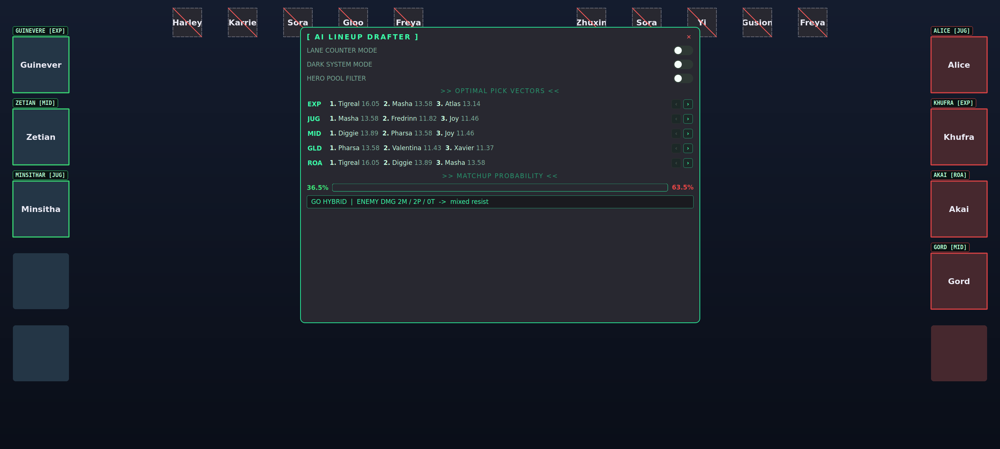

# MLBB AI Lineup Drafter — real-time drafting overlay

A PC-side **companion overlay** for Mobile Legends: Bang Bang drafts, designed
to draw directly over a **Scrcpy mirror** of your phone at **2712 × 1220**. It
reads the publicly-visible draft (the picks/bans both teams already see),
recommends optimal counter-picks per lane, and renders a pixel-perfect neon HUD
in the style of the "Otev-" AI LINEUP DRAFTER.

> **Scope:** this is an *analytical aid*. It only looks at the mirrored draft
> screen — it does **not** inject into, read memory from, or automate the game,
> and it gives no in-match mechanical advantage. Treat it like a drafting coach
> watching your screen.



---

## Architecture

```
update/
├── main.py          # entry point: capture→detect QThread → engine → overlay
├── config.py        # resolution, PIXEL-PERFECT slot boxes, weights, theme
├── detector.py      # OpenCV pipeline: template match + histogram fallback,
│                    #   per-slot caching, lane-prediction optimiser
├── engine.py        # the scoring brain (pure, testable maths)
├── ui.py            # PyQt5: click-through canvas + interactive control dock
├── stats_provider.py# pluggable live-stats overlay (HTTP/JSON + TTL cache)
├── heroes.json      # hero database (roles, win/ban %, counters, synergies…)
├── requirements.txt
├── templates/       # drop cropped hero avatars here (see templates/README.md)
├── tests/           # engine + optimiser unit tests
└── docs/            # rendered preview
```

### Data flow
```
ScreenCapturer.grab()  ──►  DraftDetector.detect()  ──►  DraftState
        (mss, cached)            (cv2, slot cache)            │
                                                              ▼
                                ScoringEngine.evaluate(state, settings)
                                                              │
                                                              ▼
                         DraftOverlay  ( OverlayCanvas + ControlDock )
```

The capture+detect loop runs on a background `QThread` and only emits when the
board changes; the detector caches unchanged slots (≈12× faster on idle
frames). The Qt event loop never blocks, so toggles and animations stay smooth.

---

## Install & run

```bash
pip install -r requirements.txt          # PyQt5, opencv-python, numpy, mss

python main.py --mock                     # preview the HUD with a scripted draft
python calibrate.py                       # one-time: click to align boxes (any resolution)
python main.py                            # live; captures your whole monitor
python main.py --accept-low               # also trust low-confidence guesses
python main.py --region 0,0,1366,614      # capture only a sub-region if you prefer
```

> Works at any PC resolution (1366×768, 1080p, …) — it captures your real
> screen, not the phone's 2712×1220. See **Calibration** below.

Position the Scrcpy window borderless at the top-left of the primary monitor
(or set `config.CAPTURE_ORIGIN`). Drag the dock anywhere; press **Esc** or the
✕ to close.

---

## Hero templates (auto-download — no screenshots!)

Don't grind ranked to screenshot 130 heroes. One command pulls a portrait for
every hero into `templates/`:

```bash
python fetch_templates.py            # whole roster (~130 portraits)
python fetch_templates.py --only-db  # just the heroes in heroes.json
python fetch_templates.py --overwrite
```

It reads a JSON source that pairs each hero with an image URL (default: a public
community DB whose `portrait` field is a 128×128 square on the official CDN),
centre-crops to a square and saves `templates/<hero>.png`. Name matching is
fuzzy, so spelling variants (e.g. "Minsithar" vs "Minsitthar") still resolve.
Fully pluggable — point it at any source:

```bash
python fetch_templates.py --source-url <url> --record-path data \
       --name-keys hero_name,uid --image-key portrait
```

> Portraits are game assets fetched for personal, local template-matching use;
> they're git-ignored and never committed. For the last few % of accuracy you
> can drop a hand-cropped draft portrait over any specific file.

### Already have an icon pack? Import it.

If you have a local folder of hero icons — including the common **circular
icons with transparent corners** — import them directly (no download):

```bash
python import_icons.py --src /path/to/heroes            # import the whole pack
python import_icons.py --src ./heroes --only-db         # only heroes.json heroes
python import_icons.py --src ./heroes --shape inscribed # face-only crop
python import_icons.py --src ./heroes --bg 12,18,16     # bg for transparent corners
```

It composites each circle onto a solid background (so transparency doesn't
break matching), squares + resizes it, and **canonicalises the filename to your
DB spelling** (e.g. a pack's `Minsitthar.png` is saved as `minsithar.png`).
Filenames already being hero names (`Luo Yi.png`, `X.Borg.png`) just work.
Mix freely with `fetch_templates.py` to backfill any hero the pack is missing
(run it without `--overwrite` and it only grabs the gaps).

## Calibration (works at ANY PC resolution)

Your phone is 2712×1220, but Scrcpy scales it to fit your PC (e.g. 1366×768),
so hard-coded coordinates land off-screen. Two things handle this:

1. **Full-screen capture by default.** The app grabs your whole primary monitor
   and draws over it, so it works at your real resolution no matter how Scrcpy
   scaled the mirror. (Override with `--region L,T,W,H` if you want.)
2. **Click-to-calibrate.** Because the draft UI is asymmetric (ally = circular
   avatars far-left, enemy = splash art far-right, bans = small circles in the
   top corners), run a one-time calibration:

   ```bash
   python calibrate.py
   ```
   It screenshots your monitor and asks you to click **8 points** — the first
   and last slot of each group (ally picks, enemy picks, ally bans, enemy bans).
   It computes all 20 boxes, lets you fine-tune size with `[` / `]`, and saves
   `layout.json`. `main.py` loads it automatically for pixel-perfect placement.

   > Re-run it if you move/resize the Scrcpy window. `layout.json` is per-device
   > and git-ignored.

Without calibration the app falls back to scaled fractional anchors — close, but
calibrate once for exact boxes.

---

## The scoring engine

Every candidate starts at a **baseline of 10**, then:

| Term | Effect |
|------|--------|
| Win rate | `+0.22 × (win_rate − 50)` — global form |
| Ban rate | `+0.06 × ban_rate` — contested heroes are strong |
| Synergy  | `+2.6` per allied synergy hit |
| Counter  | `+3.1` per enemy this hero hard-counters |
| Countered| `−3.6` per enemy that counters this hero |
| **Comp Balancer** | if the ally team lacks a frontline or magic damage, matching heroes get a **×1.25** multiplier |

### Toggles
- **Lane Counter Mode** — drops broad synergies; only the **direct lane
  opponent's** counter relationship counts, amplified **×3**.
- **Dark System Mode** — `score = −score`, surfacing the statistically *worst*
  picks (for the memes / draft-troll analysis).
- **Hero Pool Filter** — restrict candidates to heroes flagged `"owned": true`.

### Outputs
- **Optimal Pick Vectors** — top-3 per lane, with `‹ ›` chevrons to scroll the
  Top-10 (great for a limited hero pool).
- **Matchup Probability** — logistic estimate from net stat + counter advantage.
- **Build Path Feed** — reads the enemy damage/durability profile and prints
  `GO FULL DAMAGE` / `GO HYBRID` / `GO FULL TANK` plus a resist hint.

---

## Live hero stats (optional)

`heroes.json` is the always-present seed/fallback. To overlay fresh win/ban
rates (or counters) from any source, point the pluggable provider at a JSON
endpoint — nothing site-specific is hard-coded:

```bash
python main.py --stats-url https://example.com/mlbb/heroes.json
```

Describe the payload's shape in `config.py`:

```python
STATS_URL        = "https://example.com/mlbb/heroes.json"
STATS_RECORD_PATH = "data.heroes"        # dotted path to the list/dict of records
STATS_NAME_KEY    = "name"
STATS_FIELD_MAP   = {"win_rate": "winRate", "ban_rate": "banRate"}  # ours -> theirs
STATS_CACHE_TTL   = 3600                  # serve cache for 1h
STATS_REFRESH_SEC = 900                   # auto-refresh every 15 min
```

How it behaves (`stats_provider.py`):
- `HttpJsonStatsProvider` fetches + normalises the JSON to our schema (stdlib
  `urllib`, no extra dependency).
- `CachedStatsProvider` wraps it with an on-disk TTL cache and **serves stale
  data if the network is down** instead of crashing the overlay.
- `StatsRepository.build()` overlays live data onto the seed and **degrades to
  `heroes.json` on any error**; `refresh()` mutates the live `HeroDB` in place
  on a `QTimer`, so the engine immediately re-scores on fresh numbers.
- Writing your own scraper? Wrap it in `CallableStatsProvider(fn)` — same
  caching/refresh machinery applies.

## Why two windows?

A single window cannot be globally **click-through** *and* host clickable
buttons. So:

- `OverlayCanvas` uses `Qt.WindowTransparentForInput` — pure painting, never
  steals a click from the game.
- `ControlDock` is a separate interactive, draggable, translucent panel.

`DraftOverlay` ties them together behind one small update API.

---

## Tests

```bash
python tests/test_engine.py     # or: pytest -q
python engine.py                # scoring self-test across all 4 modes
python detector.py              # synthetic-frame match + cache + lane test
```
