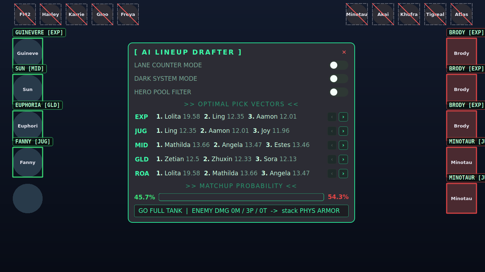

# MLBB AI Lineup Drafter — real-time drafting overlay

A PC-side **companion overlay** for Mobile Legends: Bang Bang drafts, designed
to draw directly over a **Scrcpy mirror** of your phone at **2712 × 1220**. It
reads the publicly-visible draft (the picks/bans both teams already see),
recommends optimal counter-picks per lane, and renders a pixel-perfect neon HUD
in the style of the "Otev-" AI LINEUP DRAFTER.

> **Scope:** this is an *analytical aid*. It only looks at the mirrored draft
> screen — it does **not** inject into, read memory from, or automate the game,
> and it gives no in-match mechanical advantage. Treat it like a drafting coach
> watching your screen.


---

## Architecture

```
update/
├── main.py          # entry point: capture→detect QThread → engine → overlay
├── config.py        # resolution, PIXEL-PERFECT slot boxes, weights, theme
├── detector.py      # capture → per-slot crops → recognition (DINOv2 or
│                    #   templates), per-slot caching, lane-prediction optimiser
├── recognizer.py    # optional DINOv2 recognition: fingerprints, double-check,
│                    #   learn-from-screen memory
├── icon_match.py    # the clean art registered into each slot (pure OpenCV):
│                    #   names ban icons, referees picks, spots hovers
├── requirements-ai.txt # optional AI stack for recognizer.py
├── engine.py        # the scoring brain (pure, testable maths)
├── ui.py            # PyQt5: click-through canvas + interactive control dock
├── stats_provider.py# pluggable live-stats overlay (HTTP/JSON + TTL cache)
├── meta.py          # the live meta from the official hero rank
│                    #   (tools/update_meta.py writes it to heroes.json)
├── heroes.json      # hero database (roles, win/ban %, counters, synergies…)
├── requirements.txt
├── templates/       # drop cropped hero avatars here (see templates/README.md)
├── tests/           # engine + optimiser unit tests
└── docs/            # rendered preview
```

### Data flow
```
ScreenCapturer.grab()  ──►  DraftDetector.detect()  ──►  DraftState
        (mss, cached)            (cv2, slot cache)            │
                                                              ▼
                                ScoringEngine.evaluate(state, settings)
                                                              │
                                                              ▼
                         DraftOverlay  ( OverlayCanvas + ControlDock )
```

The capture+detect loop runs on a background `QThread` and only emits when the
board changes; the detector caches unchanged slots (≈12× faster on idle
frames). The Qt event loop never blocks, so toggles and animations stay smooth.

---

## Install & run

```bash
pip install -r requirements.txt          # PyQt5, opencv-python, numpy, mss

python main.py --mock                     # preview the HUD with a scripted draft
python main.py --calibrate                # one-time: click to align boxes (any resolution)
python main.py                            # live; captures your whole monitor
python main.py --accept-low               # also trust low-confidence guesses
python main.py --region 0,0,1366,614      # capture only a sub-region if you prefer
```

> Works at any PC resolution (1366×768, 1080p, …) — it captures your real
> screen, not the phone's 2712×1220. See **Calibration** below.

Position the Scrcpy window borderless at the top-left of the primary monitor
(or set `config.CAPTURE_ORIGIN`). Drag the dock anywhere; press **Esc** or the
✕ to close.

---

## DINOv2 hero recognition (recommended)

Recognition — which hero sits in which slot — is the hard part of the overlay.
With the optional AI stack installed, the app names heroes with **DINOv2**, a
small local vision model (~90 MB, runs offline after the first start), and
**double-checks every name with a second, independent method**: the hero's
clean art is registered (scaled, shifted, mirrored) into the slot and
correlated pixel by pixel (`icon_match.py`).

Measured on **11 real 1366×768 screenshots of two drafts** (176 hero slots:
skins, tiny ban icons, compression, the old overlay's labels drawn over the
portraits, a hovered hero), using downloaded art only:

| Recognizer | Correct | Wrong labels |
|---|---|---|
| Template matching (old, with its learned seeds) | 162 / 176 | 2 (Hanabi→Ixia, Miya→Layla) |
| DINOv2 alone (first version) | 139 / 176 | 4 (Minsithar, Saber, Floryn, Hanabi) + a hovered Helcurt shown as picked |
| **DINOv2 + registered art (what ships)** | **176 / 176** | **0** |

**Bans** are the same portrait art at a fixed scale under the red ban badge,
so the registered art decides: the true hero scores 0.91–0.99 and no other
hero above 0.78, and DINOv2 — fed the same masked icon — must agree. Rendered
for all 131 heroes as synthetic ban icons, every one is named correctly (the
closest pair, Benedetta/Ixia, still 0.21 apart).

**Picks** are named by DINOv2 (it copes with skins and the portraits'
hero-specific framing); a near-tie goes to the registered art as referee.

**Hover vs locked.** A pre-selected (hovered, not locked) hero is drawn at
about half contrast: the art fit measures 0.50 for a hovered Helcurt against
0.70–0.96 for every locked pick, so a hover reads **NOT PICKED** until it
locks in.

**The overlay never covers a slot.** The overlay is part of every screen
capture, so boxes are drawn just outside the slots and labels go where they
cover no slot (they used to sit on the portrait above and be read as part of
that hero).

Install it once:

```bash
pip install torch torchvision --index-url https://download.pytorch.org/whl/cpu
pip install -r requirements-ai.txt
python main.py        # first start: downloads the model + fingerprints the roster (~20 s, once)
```

Without these packages — or with `python main.py --no-dino` — the app uses
template matching for picks, and the registered art (pure OpenCV) still names
the bans and flags hovers. The console says which engine is active.

**The double-check.** A pick gets a name only when DINOv2's best match is
similar enough (`DINO_MIN_SIM`) **and** clearly ahead of the runner-up
(`DINO_CLEAR_MARGIN`); on a near-tie the registered art must pick one of the
tied candidates. A ban needs the registered art to be sure (`BAN_NCC_MIN`,
`BAN_NCC_MARGIN`) and DINOv2 not to disagree. Anything else stays blank, never
a guessed name. `python tools/diagnose.py` prints both methods' evidence for
every slot.

**Speed.** Changed slots are recognised in one batch (~0.9 s for a whole cold
board on a laptop CPU). A slot whose pixels only pulse with the draft animation
keeps its label without running the model (~5 ms per frame).

**Memory.** A confident, locked pick is saved to `templates_learned_dino/` as
an extra reference for that hero, so your skins become near-certain matches
over time. Remembered crops are double-checked on every start: one that
clearly shows a different hero than it is filed under (an old mislabel) is
ignored, and the console says so.

**Clean art vs screen crops.** Downloaded portraits live in `templates*/`;
crops taken off your screen belong in `templates_learned*/`. A screen crop
carries the slot's ring, badges or red ban slash, which every other slot of
that type shares, so it only counts when it is a near-exact match
(`DINO_SCREEN_MIN`). Heroes with no public art (currently **Sora**) are
recognised from their screen crop this way.

---

## Hero templates (auto-download — no screenshots!)

Don't grind ranked to screenshot 130 heroes. One command pulls a portrait for
every hero into `templates/`:

```bash
python fetch_templates.py            # whole roster (~130 portraits)
python fetch_templates.py --only-db  # just the heroes in heroes.json
python fetch_templates.py --overwrite
```

It reads a JSON source that pairs each hero with an image URL (default: a public
community DB whose `portrait` field is a 128×128 square on the official CDN),
centre-crops to a square and saves `templates/<hero>.png`. Name matching is
fuzzy, so spelling variants (e.g. "Minsithar" vs "Minsitthar") still resolve.
Fully pluggable — point it at any source:

```bash
python fetch_templates.py --source-url <url> --record-path data \
       --name-keys hero_name,uid --image-key portrait
```

> Portraits are game assets fetched for personal, local template-matching use;
> they're git-ignored and never committed. For the last few % of accuracy you
> can drop a hand-cropped draft portrait over any specific file.

### Already have an icon pack? Import it.

If you have a local folder of hero icons — including the common **circular
icons with transparent corners** — import them directly (no download):

```bash
python import_icons.py --src /path/to/heroes            # import the whole pack
python import_icons.py --src ./heroes --only-db         # only heroes.json heroes
python import_icons.py --src ./heroes --shape inscribed # face-only crop
python import_icons.py --src ./heroes --bg 12,18,16     # bg for transparent corners
```

It composites each circle onto a solid background (so transparency doesn't
break matching), squares + resizes it, and **canonicalises the filename to your
DB spelling** (e.g. a pack's `Minsitthar.png` is saved as `minsithar.png`).
Filenames already being hero names (`Luo Yi.png`, `X.Borg.png`) just work.
Mix freely with `fetch_templates.py` to backfill any hero the pack is missing
(run it without `--overwrite` and it only grabs the gaps).

**Template sets (one orientation policy).**
- `templates/` — square base → **enemy PICKS** seed; art as-is (right-facing).
- `templates_circle/` — circular → **ally PICKS + BAN rows**; art as-is (right).
- `templates_ally/` — per-side override for ally picks; art as-is (right).
- `templates_enemy/` — per-side override for enemy picks; **mirrored (left)**.

All four sets are regenerated together from the up-to-date community source by:

```bash
python tools/rebuild_templates.py        # nuke + rebuild every set, 1 hero = 1 file
```

It alpha-composites, centre-squares to 160×160, names files to your
`heroes.json` spelling (kills stray duplicate spellings), and falls back to the
existing local art for any hero the source lacks — so the sets can never drift
apart. To hand-fix a single hero, drop a crop over
`templates_ally/<hero>.png` / `templates_enemy/<hero>.png` (or grab it straight
off a live draft with `python tools/learn_templates.py` — useful for **skinned
avatars**, whose art no official source carries).

Matching is **zoom-tolerant** (`MATCH_ZOOM_CROPS` / `MATCH_SCALES_DOWN`): each
template is also tried slightly zoomed-in and scaled-down, so ring borders, the
red ban-slash and small calibration slop don't sink the score.

### No colour-guessing + a memory that learns your screen

Downloaded portraits don't match every on-screen avatar — **skins, ring borders
and the exact in-game render** differ — and the old HSV colour fallback, while
it caught some, also *confidently mislabelled* look-alikes (Helcurt→Gord,
skinned Melissa→Ixia). A wrong name is worse than a blank, so:

- **`USE_HISTOGRAM_FALLBACK = False`** by default — colour alone never names a
  slot; anything unsure stays **blank** (never wrong).
- **Confirmed-colour fallback** (`HIST_CONFIRM_FALLBACK`): below the template
  threshold, a hero is still accepted when **two independent signals agree** —
  it is the histogram winner (≥ `HIST_CONFIRM_MIN`) *and* already in that
  crop's template top-K. This recovers heroes with weak downloaded art (e.g.
  Johnson) without reviving look-alike mislabels: a name-bar crop's Gord
  colour match is rejected because Gord isn't structurally plausible there.
- **Learned memory** (`templates_learned/`, `templates_learned_enemy/`): every
  crop the detector recognises *confidently by template* (`AUTO_LEARN`,
  ≥ `LEARN_MIN_SCORE`) is saved and reused as the **highest-priority** template,
  so that hero self-matches ~1.0 forever after — it remembers your skins. These
  folders are git-ignored (per-screen); a few seed crops are bundled.

To teach it a hero it can't yet match (a brand-new or heavily-skinned one), grab
it straight off the draft — no ranked grind, just name the slots once:

```bash
python tools/learn_templates.py --ally ,,,,helcurt        # learn slot 5 = Helcurt
```

Validated end-to-end against real 1366×768 crops in `tests/fixtures/real_draft/`:
**20/20 match expected, 0 mislabelled** (skins + the new hero **Sora** resolve
via learned memory; one mis-calibrated slot stays correctly blank).

If detection misreads or misses a hero, run the diagnostics:

```bash
python tools/diagnose.py        # prints top-3 matches + scores per slot
```

It saves each slot crop to `diag/` and shows why a hero matched (or didn't), so
the thresholds in `config.py` can be tuned. For pick slots it also prints
`sat`/`val` and a **`NOT PICKED (grayed)`** verdict — the exact numbers behind
the lock gate below. Regenerate the circular set with
`python import_icons.py --src <icons> --out templates_circle`.

### "Not picked yet" (grayed) detection

A confirmed pick renders in **full colour**; a hero merely being *hovered* (not
yet locked) renders **grayed** — desaturated **and** dimmed. The detector flags
such a slot as un-locked (relative to the bright/saturated locked picks in the
same column) and the overlay draws a dashed grey box labelled **`NOT PICKED`**
instead of guessing a hero from faded colours. This stops a greyed avatar from
being mis-read as the wrong hero (e.g. a hovered Helcurt matching Gord) and from
polluting the lane assignment. Tune the two relative fractions in `config.py`:

```python
LOCKED_REL_SATURATION = 0.60   # grayed if saturation < 60% of the column's max
LOCKED_REL_VALUE      = 0.75   # ...AND brightness  < 75% of the column's max
```

Set either to `0` to disable that half (both `0` turns the feature off). It's
*relative*, so a hero who is naturally dark (Helcurt) or pale (Sora) but **is**
locked still reads as picked.

## Calibration (works at ANY PC resolution)

Your phone is 2712×1220, but Scrcpy scales it to fit your PC (e.g. 1366×768),
so hard-coded coordinates land off-screen. Two things handle this:

1. **Full-screen capture by default.** The app grabs your whole primary monitor
   and draws over it, so it works at your real resolution no matter how Scrcpy
   scaled the mirror. (Override with `--region L,T,W,H` if you want.)
2. **DPI-aware.** On Windows the app makes itself DPI-aware so screen capture
   (physical px) and the overlay (PyQt) share one coordinate space — display
   scaling (125 %/150 %) no longer offsets the boxes.

3. **Click-to-calibrate.** The draft UI is asymmetric (ally = circular avatars
   far-left, enemy = splash art far-right, bans = small circles in the top
   corners), so align once — directly on the live game:

   ```bash
   python main.py --calibrate
   ```
   A transparent overlay appears over the draft. Click **8 points** — the first
   and last slot of each group (ally picks, enemy picks, ally bans, enemy bans).
   Tune box size with `[` / `]`, press **S** to save `layout.json` (Esc cancels,
   R restarts). `main.py` then loads it automatically. Because you click on the
   live game in the overlay's own coordinate space, it's WYSIWYG.

   > Re-run if you move/resize the Scrcpy window. `layout.json` is per-device and
   > git-ignored. A standalone `python calibrate.py` (cv2 window) exists too, but
   > needs the GUI OpenCV build (`opencv-python`, not `-headless`).

Without calibration the app falls back to scaled fractional anchors — close, but
calibrate once for exact boxes.



---

## The scoring engine

Every candidate starts at a **baseline of 10**, then:

| Term | Effect |
|------|--------|
| Win rate | `+0.22 × (win_rate − 50)` — global form |
| Ban rate | `+0.06 × ban_rate` — contested heroes are strong |
| Synergy  | `+2.6` per allied synergy hit |
| Counter  | `+3.1` per enemy this hero hard-counters |
| Countered| `−3.6` per enemy that counters this hero |
| Ban relief | `+1.2` per hero that counters this pick being **banned** (a threat is off the board) |
| **Comp Balancer** | if the ally team lacks a frontline or magic damage, matching heroes get a **×1.25** multiplier |

### Toggles
- **Lane Counter Mode** — drops broad synergies; only the **direct lane
  opponent's** counter relationship counts, amplified **×3**.
- **Dark System Mode** — `score = −score`, surfacing the statistically *worst*
  picks (for the memes / draft-troll analysis).
- **Hero Pool Filter** — restrict candidates to heroes flagged `"owned": true`.

### Outputs
- **Optimal Pick Vectors** — top-3 per lane, with `‹ ›` chevrons to scroll the
  Top-10 (great for a limited hero pool).
- **Matchup Probability** — logistic estimate from net stat + counter advantage.
- **Build Path Feed** — reads the enemy damage/durability profile and prints
  `GO FULL DAMAGE` / `GO HYBRID` / `GO FULL TANK` plus a resist hint.

---

## The live meta (official hero rank)

The meta changes every patch, so the app keeps itself current from the
**official source**: Moonton's own hero-rank data — the numbers behind the
Hero Rank page on the official site (no account or key needed). For every
hero: win / pick / ban rate over the past 7 days (all ranks), the 5 enemies it
does best against (`counters`), the 5 it struggles against (`countered_by`),
and its 5 best teammates (`synergies`).

**Automatic.** `python main.py` starts instantly from `heroes.json` + the last
good copy, then refreshes in the background (and every 15 minutes) — the
overlay never waits on the website, and offline it keeps the last numbers.
When the official roster has a hero your `heroes.json` doesn't, the console
says so. `--no-meta` turns it off.

**Permanent / new heroes.** One command writes the current meta into
`heroes.json` and adds newly released heroes — with their official portraits
in every template folder, so the detector recognises them too:

```bash
python tools/update_meta.py                     # past 7 days, all ranks
python tools/update_meta.py --days 30 --rank mythic
python tools/update_meta.py --dry-run           # just show what would change
```

It backs up `heroes.json` first, keeps your own fields (owned heroes,
archetypes, damage type), updates recommended lanes/roles from the official
roster (`--keep-lanes` to skip), and new heroes start as not owned
(`tools/set_owned.py` when you buy them). Settings: `META_DAYS` (1/3/7/15/30),
`META_RANK` (all/epic/legend/mythic/honor/glory) in `config.py`.

### Your own stats source (optional)

`heroes.json` is the always-present seed/fallback. To overlay win/ban rates
(or counters) from a different source instead, point the pluggable provider at
a JSON endpoint — nothing site-specific is hard-coded:

```bash
python main.py --stats-url https://example.com/mlbb/heroes.json
```

Describe the payload's shape in `config.py`:

```python
STATS_URL        = "https://example.com/mlbb/heroes.json"
STATS_RECORD_PATH = "data.heroes"        # dotted path to the list/dict of records
STATS_NAME_KEY    = "name"
STATS_FIELD_MAP   = {"win_rate": "winRate", "ban_rate": "banRate"}  # ours -> theirs
STATS_CACHE_TTL   = 3600                  # serve cache for 1h
STATS_REFRESH_SEC = 900                   # auto-refresh every 15 min
```

How it behaves (`stats_provider.py`):
- `HttpJsonStatsProvider` fetches + normalises the JSON to our schema (stdlib
  `urllib`, no extra dependency).
- `CachedStatsProvider` wraps it with an on-disk TTL cache and **serves stale
  data if the network is down** instead of crashing the overlay.
- `StatsRepository.build()` overlays live data onto the seed and **degrades to
  `heroes.json` on any error**; the app refreshes on a background thread and
  mutates the live `HeroDB` in place, so the engine immediately re-scores on
  fresh numbers.
- Writing your own scraper? Wrap it in `CallableStatsProvider(fn)` — same
  caching/refresh machinery applies.

## Why two windows?

A single window cannot be globally **click-through** *and* host clickable
buttons. So:

- `OverlayCanvas` uses `Qt.WindowTransparentForInput` — pure painting, never
  steals a click from the game.
- `ControlDock` is a separate interactive, draggable, translucent panel.

`DraftOverlay` ties them together behind one small update API.

---

## Tests

```bash
python tests/test_engine.py     # or: pytest -q
python tests/test_meta.py       # official hero rank -> stats, roster, heroes.json
python tests/test_recognizer.py # double-check rules, memory, and 3 REAL screenshots
                                # end-to-end (every slot, the hover, the bans)
python engine.py                # scoring self-test across all 4 modes
python detector.py              # synthetic-frame match + cache + lane test
```

The real-crop DINOv2 test needs the optional AI stack and skips without it.
